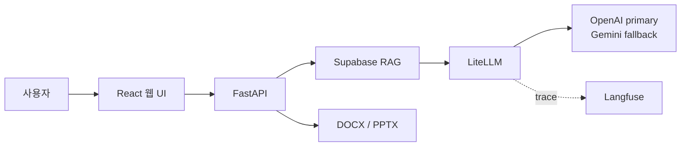

<div align="center">


# LessonPack AI

**교재와 NCS 근거를 바탕으로 교안·실습·평가 패키지를 생성하는 직업훈련 강의 운영 보조 서비스**

[서비스 이용](https://lessonpack-ai.lovable.app/) ·
[API 문서](https://34.47.92.210.nip.io/docs) ·
[백엔드 저장소](https://github.com/RyuGernwoo/Job_AI_Agent) ·
[프론트엔드 저장소](https://github.com/RyuGernwoo/lessonpack-ai)

</div>

## 서비스 이용

LessonPack AI는 과정 정보와 교재를 입력받아 다음 산출물을 한 번에 생성합니다.

- 학습목표와 시간 배분을 반영한 강의 교안
- 단계별 실습 과제와 제출물
- 객관식 문항, 실습형 평가와 루브릭
- 생성에 사용된 교재·NCS 근거 목록
- DOCX 및 PPTX 다운로드 파일

별도의 설치나 API 키 없이 [배포 서비스](https://lessonpack-ai.lovable.app/)에서 사용할 수 있습니다.

### 이용 순서

1. 강의 유형과 과정 정보를 입력합니다. 첫 화면은 `NCS 기반 강의`가 기본이며 일반 강의로 변경할 수 있습니다.
2. 선택 사항으로 PowerPoint 템플릿을 등록하고, 강의 근거로 사용할 PDF·Markdown·TXT 교재를 업로드합니다.
3. 교재 업로드 후 RAG 검색과 패키지 생성이 자동으로 진행됩니다.
4. 결과를 확인하고 필요하면 자연어로 수정 지시를 입력한 뒤 DOCX 또는 PPTX로 내려받습니다.

패키지 생성 후 이전 단계로 돌아가면 입력값은 조회 전용으로 유지됩니다. 새로운 과정이 필요할 때는 다운로드 단계의 `새 프로젝트 시작`을 사용합니다.

### 주요 기능

| 기능 | 내용 |
| --- | --- |
| NCS·일반 강의 분리 | 강의 유형에 따라 입력 검증, 근거 검색, 생성, 품질 점검 정책을 구분 |
| NCS 카탈로그 검색 | 공식 능력단위 코드와 명칭을 검색하고 상세 수행준거 적재 상태를 표시 |
| 프로젝트 우선 RAG | 사용자가 올린 교재를 우선 검색하고 공통 데이터로 부족한 근거를 보완 |
| 패키지 자동 생성 | 교안·실습·평가를 동일한 학습목표와 근거에 맞춰 생성 |
| 자연어 재생성 | 기존 패키지를 기준으로 수정 지시를 반영한 새 버전 생성 |
| PPT 템플릿 | 원본 슬라이드를 표지·교안·실습·평가·출처 역할로 분석해 다양한 디자인을 적용하고 실패 시 기본 디자인으로 대체 |
| 근거 중심 내보내기 | 본문 가독성을 유지하고 마지막 단원에 출처를 모아 표시 |

### NCS 데이터 범위

`수행준거 0개 · RAG 미적재`는 능력단위가 잘못되었다는 뜻이 아닙니다. 공식 코드와 명칭은 카탈로그에 있지만 LessonPack이 사용할 상세 수행준거가 아직 동기화되지 않은 상태입니다.

- 전체 카탈로그: 공식 CSV·API에서 수집한 능력단위 식별 정보
- 상세 NCS 데이터: 수행준거와 학습모듈이 구조화·임베딩된 범위
- 프로젝트 자료: 사용자가 해당 과정에 직접 업로드한 교재와 기관 자료

상세 RAG가 없는 분야도 사용자가 수행준거를 입력하고 관련 교재를 업로드하면 생성할 수 있습니다. 다만 이 경우 공식 수행준거 검증 완료 상태와 구분해 표시합니다.

### 준비할 정보

- 과정명, 차시명, 대상자 수준과 선수지식
- 총 훈련 시간, 총 차시, 이론·실습 비율
- 이번 차시의 학습목표
- NCS 강의인 경우 능력단위와 대상 수행준거
- 근거 교재: PDF·Markdown·TXT, 파일당 최대 20MB
- 선택 사항: PowerPoint 템플릿, 최대 25MB

> LessonPack AI는 강의 초안을 만드는 도구입니다. 실제 교육과 평가에 사용하기 전에 내용, 난이도, 저작권과 NCS 적합성을 확인해야 합니다.

## 개발자 안내

백엔드와 프론트엔드는 서로 다른 Git 저장소입니다.

| 저장소 | 역할 |
| --- | --- |
| [Job_AI_Agent](https://github.com/RyuGernwoo/Job_AI_Agent) | FastAPI, RAG, LLM 생성, Supabase, 내보내기, CI/CD |
| [lessonpack-ai](https://github.com/RyuGernwoo/lessonpack-ai) | Lovable 기반 React·TypeScript 웹 UI |



### 백엔드 빠른 실행

요구 사항은 Python 3.11 이상과 Docker입니다. 실제 LLM·RAG 실행에는 `.env.example`에 정리된 외부 서비스 키가 필요합니다.

```powershell
git clone https://github.com/RyuGernwoo/Job_AI_Agent.git
Set-Location Job_AI_Agent
Copy-Item .env.example .env
docker compose up -d --build
python scripts\check_deployment.py http://127.0.0.1:8000
```

- Swagger UI: `http://127.0.0.1:8000/docs`
- 기본 상태: `http://127.0.0.1:8000/health`
- RAG 상태: `http://127.0.0.1:8000/health/rag`
- PPT 템플릿 저장소 상태: `http://127.0.0.1:8000/health/ppt-template`

로컬에서 외부 API 없이 테스트하려면 `config.example.yaml`을 복사하고 `llm.provider: mock`, `vector_store.provider: memory`를 사용합니다. 운영 환경은 `.env`에서 Supabase와 외부 임베딩 설정을 명시합니다.

### 프론트엔드 실행

```powershell
git clone https://github.com/RyuGernwoo/lessonpack-ai.git
Set-Location lessonpack-ai
Copy-Item .env.example .env.local
npm ci
npm run dev
```

프론트엔드에는 공개 가능한 API 주소와 업로드 제한만 둡니다. LLM, Supabase service role, Langfuse secret은 브라우저 환경변수에 넣지 않습니다.

### 핵심 API

| Method | Endpoint | 역할 |
| --- | --- | --- |
| `GET` | `/health`, `/health/rag`, `/health/ppt-template` | 런타임 준비 상태 |
| `GET` | `/api/ncs/catalog/search` | 능력단위 코드·명칭 검색 |
| `GET` | `/api/ncs/catalog/{unit_code}` | 능력단위와 적재된 수행준거 조회 |
| `POST` | `/api/projects` | 강의 프로젝트 생성 |
| `POST` | `/api/projects/{id}/materials` | 교재 업로드와 chunk 생성 |
| `POST/GET/PUT/DELETE` | `/api/projects/{id}/ppt-template` | PPT 템플릿 관리 |
| `POST` | `/api/projects/{id}/rag/generate` | 다중 query 검색과 패키지 생성 |
| `POST` | `/api/packages/{id}/regenerate` | 자연어 수정 지시 기반 재생성 |
| `GET` | `/api/projects/{id}/ncs-coverage` | 수행준거 연결 상태 |
| `GET` | `/api/packages/{id}/export.docx`, `export.pptx` | 결과 다운로드 |

### NCS 공식 API 동기화

운영 Supabase에는 `supabase/migrations/001`부터 `010`까지 순서대로 적용합니다. 전체 카탈로그는 코드·명칭 검색용 관계형 데이터로만 저장하며 임베딩하지 않습니다. 상세 근거는 실제로 사용할 능력단위를 한 개씩 지정해 RAG에 적재합니다.

```powershell
python scripts\sync_ncs_official_api.py --mode catalog --resume
python scripts\sync_ncs_official_api.py --mode detail --unit-code 2001020231_23v5 --embed
python scripts\verify_ncs_official_sync.py --mode detail --query "프로그래밍 언어 활용 수행준거"
```

`catalog` 실행은 `ncsCompeUnitInfo`만 호출합니다. `detail` 실행은 선택한 코드의 KSA·적용범위·평가·훈련·평가문항만 저장합니다. 전체 상세 백필과 학습모듈 일괄 수집은 무료 티어 용량 보호를 위해 비활성화되어 있으며, 선택 RAG는 기본 50개 능력단위까지만 허용합니다. 동기화 운영 기준은 [NCS 공식 API 문서](docs/02_implementation-readiness/12_NCS_공식_API_RAG_자동_동기화_기획서.md)를 참고합니다.

### 검증

```powershell
python -m pytest -q
python -m compileall -q src tests scripts
python scripts\run_mvp_verification.py --use-mock-llm --output-dir outputs\eval
```

프론트엔드는 별도 저장소에서 다음을 실행합니다.

```powershell
npm run lint
npm run build
```

### 저장소 구조

```text
Job_AI_Agent/
├─ src/                    FastAPI와 도메인 서비스
├─ scripts/                데이터 준비·동기화·검증 도구
├─ supabase/migrations/    데이터베이스와 Storage 변경 이력
├─ tests/                  백엔드 자동 테스트
├─ data/gold/              소규모 평가 기준 데이터
├─ docs/                   기획·구현·운영·검증 문서
├─ .github/workflows/      CI, CD, NCS 동기화
└─ README.md
```

원천 데이터, 전처리 결과, 실행 산출물과 별도 프론트엔드 체크아웃은 Git에 포함하지 않습니다.

### CI/CD

| Workflow | 역할 |
| --- | --- |
| `CI` | 정적 검사, 테스트, Docker 이미지 빌드 검증 |
| `CD` | GHCR 이미지 생성, GCE 배포, 상태 확인 |
| `NCS Official API Sync` | 카탈로그·상세 수행준거·학습모듈 증분 동기화와 검증 |

## 문서

- [문서 전체 안내](docs/README.md)
- [MVP 통합 기획서](docs/00_project-brief/01_MVP_통합_기획서.md)
- [구현명세서](docs/02_implementation-readiness/01_구현명세서.md)
- [RAG 구축·연동 기획서](docs/02_implementation-readiness/07_RAG_구축_연동_기획서.md)
- [NCS 전체 카탈로그 운영 기준](docs/02_implementation-readiness/11_NCS_전체_카탈로그_검색_구축.md)
- [NCS 공식 API 동기화](docs/02_implementation-readiness/12_NCS_공식_API_RAG_자동_동기화_기획서.md)
- [PPT 템플릿 생성](docs/02_implementation-readiness/13_PPT_템플릿_기반_강의자료_생성_기획서.md)
- [MVP 품질 평가](docs/04_validation/01_MVP_품질_평가_결과.md)

## 라이선스와 데이터

외부 교재·NCS 원문·학습모듈은 각 제공처의 이용 조건을 따릅니다. 저장소에는 재현에 필요한 소규모 평가 fixture만 포함하며, 원천 자료와 운영 데이터는 별도로 관리합니다.
