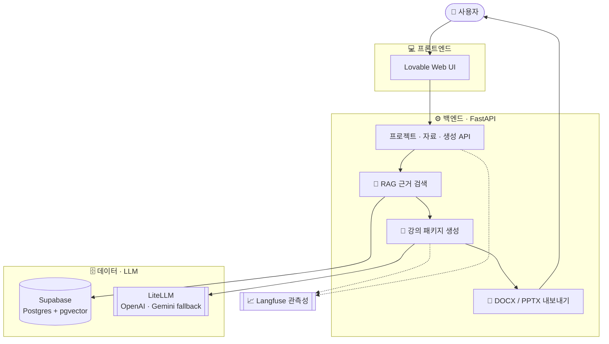

<div align="center">


# LessonPack AI 📚

**교안 · 실습 · 평가를 한 번에, 강의 준비를 위한 AI 패키지 생성 서비스**

과정 정보와 교재만 넣으면, 업로드 교재와 필요 시 **NCS 근거**를 바탕으로<br/>
강의 교안 · 실습 과제 · 평가 문항을 만들어 **DOCX / PPTX**로 내려주는 AI 서비스입니다.


<br/>

[🌐 서비스 바로가기](https://lessonpack-ai.lovable.app/) · [📑 API 문서 (Swagger)](https://34.47.92.210.nip.io/docs) · [💻 GitHub](https://github.com/RyuGernwoo)

</div>

---

## LessonPack AI란? 🤔

직업훈련 강의 하나를 준비하려면 교안, 실습 시나리오, 평가 문항, 그리고 그 근거가 되는 교재·**NCS 능력단위**까지 여러 자료를 오가며 따로 만들어야 합니다. **LessonPack AI**는 이 과정을 **자료 업로드 → AI 생성 → 파일 다운로드**의 한 흐름으로 묶어 줍니다.

> ### 이런 분들을 위해 만들었습니다
> - 🧑‍🏫 새 차시 강의안을 **빠르게 초안화**하고 싶은 **직업훈련 강사**
> - 📗 교재 내용과 **NCS 능력단위**를 함께 반영해야 하는 **교육 담당자**
> - 📝 실습과 평가 문항을 **같은 학습목표에 맞춰** 구성하고 싶은 **교안 작성자**

강의 유형을 `NCS 기반` 또는 `일반 강의`로 선택하고 과정명·차시·학습목표와 교재를 입력하면, 관련 근거 문단을 검색해 교안·실습·평가 초안을 한 번에 생성합니다. NCS 기반 강의는 대상 수행준거까지 연결하고, 일반 강의는 NCS를 주장하지 않습니다. 공통 데이터에 해당 NCS 분야가 없더라도 **사용자가 업로드한 교재를 우선 근거로 사용**합니다. 마음에 들지 않으면 **자연어로 수정 사항을 말하기만** 하면 새 버전을 만들어 줍니다.

> ⚠️ LessonPack AI는 강의 준비를 돕는 **초안 생성 도구**입니다. 생성 결과는 강사의 검토 후 사용하는 것을 전제로 합니다.

<br/>

# 👤 일반 사용자 가이드

> 배포된 LessonPack AI를 이용하는 분들을 위한 안내입니다. **설치 · API 키 · 서버 설정 없이**, 웹 페이지에 접속해 정보를 입력하기만 하면 바로 시작할 수 있습니다.

## ✨ 주요 기능

| 기능 | 한눈에 보기 |
|:---|:---|
| 📄 **강의 교안 생성** | 과정·차시·학습목표에 맞춰 강의 교안 초안을 자동 작성 |
| 🧪 **실습 과제 생성** | 수업 목표에 맞는 실습 시나리오와 수행 절차를 구성 |
| ✅ **평가 문항 생성** | 객관식 문항과 실습형 평가 과제 · 루브릭을 함께 제공 |
| 📚 **근거 출처 표시** | 생성 근거가 된 교재·NCS 문단을 산출물에 함께 정리 |
| **강의 유형 분리** | NCS 기반 강의와 일반 강의를 구분해 입력·검색·생성·내보내기 정책 적용 |
| **NCS 전체 카탈로그 검색** | 공식 능력단위 코드·명칭 13,442건 검색, 상세 RAG 미적재 분야는 수행준거 0개로 구분 |
| **NCS 수행준거 점검** | 선택한 수행준거의 교안·실습·평가 연결률과 누락 경고 제공 |
| 🗂️ **사용자 자료 fallback** | 공통 NCS 자료가 없는 분야는 업로드 교재를 프로젝트 근거로 사용 |
| 🔁 **자연어 재생성** | "난이도를 낮춰줘", "실습을 하나 더" 처럼 말로 수정 |
| 📥 **DOCX / PPTX 다운로드** | 완성된 강의 패키지를 문서·슬라이드 파일로 내려받기 |

## 📖 사용 방법

처음 사용한다면 아래 순서를 따라 해 보세요.

1. **접속** — [서비스 페이지](https://lessonpack-ai.lovable.app/)에 들어갑니다.
2. **과정 정보 입력** — NCS 기반 또는 일반 강의를 선택하고 과정명, 차시명, 학습 대상, 훈련 계획, 학습목표와 근거 검색어를 입력합니다. NCS 기반 강의라면 능력단위와 대상 수행준거도 선택합니다.
3. **교재 업로드 및 자동 생성** — Markdown · TXT · PDF 자료를 올리면 입력한 여러 검색어로 RAG 근거를 찾고 교안 · 실습 · 평가 초안을 자동 생성합니다.
4. **결과 확인·수정** — 생성 결과를 확인하고, 필요한 경우 바꾸고 싶은 점을 자연어로 입력합니다.
5. **다운로드** — 완성된 강의 패키지를 **DOCX** 또는 **PPTX**로 내려받습니다.

> 학습목표와 검색어를 구체적으로 적을수록 생성되는 교안과 평가 문항이 더 정확해집니다. NCS 기반 강의는 이번 차시에서 실제로 다룰 수행준거만 선택합니다.
>
> 공통 NCS 자료에 해당 분야가 없더라도 업로드한 교재·기관 자료가 있으면 계속 생성할 수 있습니다. 이 경우 화면에 **업로드 근거**로 표시되며, NCS 세부 기준은 사용자 입력과 업로드 자료의 범위를 넘어 임의로 확장하지 않습니다.

## 🎒 미리 준비하면 좋은 것

- 강의 **과정명 · 차시명**
- 학습자 수준 또는 선수 지식
- 총 훈련시간, 총 차시, 이론·실습 비율
- 이번 차시의 **학습목표**
- NCS 기반 강의인 경우 관련 **NCS 능력단위와 대상 수행준거**
- 교안·실습·평가에서 다룰 핵심 주제별 근거 검색어 1~5개
- 수업 근거로 쓸 교재 자료 (Markdown · TXT · PDF, 파일당 최대 20MB)

> 일반 사용자는 API 키, Supabase, Langfuse 같은 개발 설정을 **직접 다루지 않아도 됩니다.**

## 🌱 기대 효과

- ⏱️ **준비 시간 단축** — 교안·실습·평가를 처음부터 따로 만들 필요 없이 초안을 한 번에 확보
- 🎯 **일관된 구성** — 실습과 평가가 같은 학습목표에 맞춰 정렬
- 📚 **근거 기반** — 교재와 NCS에서 찾은 문단을 근거로 제시해 신뢰도 향상

<br/>

# 🛠️ 개발자 가이드

> 프로젝트를 로컬에서 실행하거나 구조를 이해하려는 개발자를 위한 안내입니다. 세부 구현보다 **전체 구성과 시작 방법** 위주로 정리했으며, 자세한 내용은 [`docs/`](docs/) 문서를 참고하세요.

## 🧩 시스템 구성

LessonPack AI는 **FastAPI 백엔드**를 중심으로, 교재를 검색(RAG)하고 LLM으로 강의 패키지를 생성해 문서 파일로 내보냅니다. 운영 UI는 Lovable로 배포된 웹 프론트가 담당합니다.



**동작 흐름**: `과정·다중 검색어 저장 → 교재 업로드·chunking → 다중 query RAG 검색·근거 병합 → LLM 강의 패키지 자동 생성 → 자연어 재생성 → DOCX/PPTX 내보내기 → Langfuse 관측`

검색은 현재 프로젝트의 업로드 자료를 먼저 사용하고 공통 baseline 자료로 남은 결과를 보충합니다. 의미 검색 결과가 없거나 공통 NCS 분야가 비어 있으면 실제 업로드 chunk를 문서별로 선택하는 fallback을 적용하며, 관련도가 낮은 baseline 결과는 생성 근거에서 제외합니다.

## 🧰 기술 스택

<p>


</p>

| 구분 | 사용 기술 |
|:---|:---|
| **API** | FastAPI, Pydantic |
| **UI** | Lovable (React + TypeScript) |
| **LLMOps** | LiteLLM, OpenAI (primary), Gemini (fallback), Langfuse |
| **Vector Store** | Supabase Postgres + pgvector |
| **Export** | python-docx, python-pptx |
| **배포 · CI/CD** | Docker, Docker Compose, GCE, GitHub Actions, GHCR |
| **테스트** | pytest / unittest, retrieval·generation 검증 스크립트 |

## 🐳 빠른 실행 (Docker)

**요구 사항**: Python 3.11+, Docker (권장). 실데이터 실행에는 Supabase, OpenAI / Gemini, Langfuse 키가 필요합니다. 전체 목록은 [`.env.example`](.env.example)을 참고하세요.

```powershell
# 1) 환경변수 준비 (.env에 실제 값 입력, secret은 커밋 금지)
Copy-Item .env.example .env

# 2) Docker로 실행
docker compose up -d --build

# 3) 배포 상태 확인
python scripts\check_deployment.py http://localhost:8000
```

확인 주소 — Swagger UI `http://127.0.0.1:8000/docs` · 헬스 체크 `http://127.0.0.1:8000/health`

> 로컬에서 실제 API 없이 흐름만 확인하려면 `config.yaml`의 `llm.provider`를 `mock`으로 설정하세요.

## 🔌 주요 API

| Method | Endpoint | 설명 |
|:---|:---|:---|
| `GET` | `/health` · `/health/rag` | 서비스 · RAG 저장소 상태 확인 |
| `GET` | `/api/ncs/catalog/search` · `/api/ncs/catalog/{unit_code}` | NCS 능력단위 검색 및 수행준거 조회 |
| `POST` | `/api/projects` | 과정 / 차시 프로젝트 생성 |
| `POST` | `/api/projects/{id}/materials` | 교재 업로드 및 chunk 생성 |
| `POST` | `/api/projects/{id}/rag/retrieve` | 프로젝트 우선 · baseline 보조 근거 검색 |
| `POST` | `/api/projects/{id}/rag/generate` | 단일·다중 query 검색과 패키지 생성 또는 기존 retrieval run 재사용 |
| `POST` | `/api/packages/{id}/regenerate` | 자연어 지시 기반 새 패키지 생성 |
| `GET` | `/api/projects/{id}/ncs-coverage` | 최신 NCS 패키지의 수행준거 커버리지 조회 |
| `GET` | `/api/packages/{id}/export.docx` · `export.pptx` | 산출물 다운로드 |

> 전체 엔드포인트는 [Swagger UI](https://34.47.92.210.nip.io/docs)에서 확인할 수 있습니다.

운영 UI는 프로젝트 입력의 `retrieval_queries`를 교재 업로드 직후 `/rag/generate`에 전달합니다. 서버는 query별 검색 결과를 하나의 retrieval run으로 병합하고 중복 chunk를 제거합니다. `/rag/retrieve`와 retrieval run 기반 생성은 API 호환성과 진단 용도로 유지합니다.

운영 Supabase에는 API 배포 전 [`005_project_retrieval_queries.sql`](supabase/migrations/005_project_retrieval_queries.sql), [`006_ncs_course_specialization.sql`](supabase/migrations/006_ncs_course_specialization.sql), [`007_ncs_catalog_search.sql`](supabase/migrations/007_ncs_catalog_search.sql), [`008_ncs_official_api_sync.sql`](supabase/migrations/008_ncs_official_api_sync.sql)을 순서대로 적용해야 합니다. NCS catalog는 한국산업인력공단의 공식 전체 능력단위 CSV와 기존 상세 RAG 데이터를 병합해 적재합니다.

```powershell
python scripts\prepare_ncs_catalog.py `
  --official-csv "C:\path\to\한국산업인력공단_국가직무능력표준 정보_20251231.csv"
python scripts\prepare_ncs_catalog.py `
  --official-csv "C:\path\to\한국산업인력공단_국가직무능력표준 정보_20251231.csv" `
  --upload
```

공공데이터포털 서비스 키를 설정하고 `LESSONPACK_NCS_API_ENABLED=true`로 활성화한 뒤 공식 능력단위 상세정보와 학습모듈 내용을 증분 동기화할 수 있습니다. `detail` 모드는 `catalog` 원본에 저장된 공식 식별자를 사용하므로 최초 실행은 `all` 또는 `catalog`로 시작합니다.

```powershell
python scripts\sync_ncs_official_api.py --mode all --resume --embed
python scripts\verify_ncs_official_sync.py `
  --query "응용SW엔지니어링 요구사항 확인 수행준거"
```

## 📁 프로젝트 구조

```text
src/            FastAPI 백엔드 (API · RAG · 생성 · export)
lessonpack-ai/  Lovable 기반 웹 프론트엔드 (React + TS)
data/           MVP·NCS 확장 데이터셋 (원본 · processed chunk · gold set)
scripts/        데이터 적재 · 검증 · 배포 확인 스크립트
docs/           기획 · 구현 · 검증 문서
tests/          자동 테스트
.github/workflows/  CI/CD workflow
```

## 🔄 CI/CD

GitHub Actions에서 테스트와 배포를 분리해 운영합니다.

| Workflow | 실행 시점 | 역할 |
|:---|:---|:---|
| `CI` | push · PR · 수동 | Python compile, 테스트, Docker build 검증 |
| `CD` | main CI 성공 후 · 수동 | GHCR 이미지 빌드/푸시, GCE 배포, health check |
| `NCS Official API Sync` | 정기 · 수동 | 공식 NCS 변경 감지, 상세정보·학습모듈 증분 임베딩, Supabase/RAG 검증 |

## 🔐 보안 주의

> - `.env`에는 실제 API 키와 service role 키가 들어갑니다. **Git에 커밋하지 마세요.**
> - Supabase `SERVICE_ROLE_KEY`는 **서버 전용 키**이며, 브라우저·프론트엔드·공개 로그에 노출하면 안 됩니다.

---

## 📚 참고 문서

- 📄 [문서 안내](docs/README.md)
- 🧭 [MVP 통합 기획서](docs/00_project-brief/01_MVP_통합_기획서.md)
- 🏗️ [구현명세서](docs/02_implementation-readiness/01_구현명세서.md)
- 🔎 [RAG 구축 및 연동 기획서](docs/02_implementation-readiness/07_RAG_구축_연동_기획서.md)
- 🗂️ [NCS 확장 데이터셋 처리 및 RAG 검증 결과](docs/02_implementation-readiness/09_NCS_확장_데이터셋_처리_검증_결과.md)
- [NCS 특화 기능 보완 기획서 및 구현 현황](docs/02_implementation-readiness/10_NCS_특화_기능_보완_기획서.md)
- [NCS 전체 카탈로그 검색 구축 및 운영 기준](docs/02_implementation-readiness/11_NCS_전체_카탈로그_검색_구축.md)
- [NCS 공식 API 기반 RAG 자동 동기화 기획서](docs/02_implementation-readiness/12_NCS_공식_API_RAG_자동_동기화_기획서.md)
- ✅ [MVP 품질 평가 결과](docs/04_validation/01_MVP_품질_평가_결과.md)
- 🚀 [GCE Docker CI/CD 배포 계획서](docs/02_implementation-readiness/05_GCE_Docker_CICD_배포_계획서.md)

## ✍️ 작성자

| 이름 | 역할 | GitHub |
|:---|:---|:---|
| RyuGernwoo | FastAPI, RAG, LLMOps, Export, CI/CD, GCE Infra | [@RyuGernwoo](https://github.com/RyuGernwoo) |
