# LessonPack AI WBS

## 1. 문서 목적

이 문서는 LessonPack AI의 기획, 구현, 데이터, 검증 및 운영 작업을 작업 분해 구조(Work Breakdown Structure)로 관리하기 위한 기준 문서다. 상태는 2026-07-23 현재 저장소와 배포 구성을 기준으로 한다.

상태 정의:

| 상태 | 의미 |
| --- | --- |
| 완료 | 구현과 기본 검증이 끝난 작업 |
| 운영 중 | 구현은 완료됐으며 반복 실행 또는 모니터링 중인 작업 |
| 진행 중 | 일부 구현됐으나 데이터 확장이나 검증이 남은 작업 |
| 예정 | MVP 이후 안정화를 위해 수행할 작업 |

## 2. 작업 분해 구조

```mermaid
flowchart TD
    WBS["LessonPack AI"]
    WBS --> P1["1. 서비스 기획"]
    WBS --> P2["2. 데이터·RAG"]
    WBS --> P3["3. 백엔드"]
    WBS --> P4["4. 프론트엔드"]
    WBS --> P5["5. LLMOps"]
    WBS --> P6["6. 배포·운영"]
    WBS --> P7["7. 검증"]
    WBS --> P8["8. 운영 안정화"]

    P1 --> P11["요구사항·MVP 범위"]
    P1 --> P12["NCS·비NCS 흐름"]
    P2 --> P21["교재 전처리·청킹"]
    P2 --> P22["임베딩·Supabase 적재"]
    P2 --> P23["NCS 공식 API 동기화"]
    P3 --> P31["프로젝트·업로드 API"]
    P3 --> P32["RAG 생성·재생성 API"]
    P3 --> P33["DOCX·PPTX 내보내기"]
    P4 --> P41["4단계 사용자 흐름"]
    P4 --> P42["NCS 검색·템플릿 UI"]
    P5 --> P51["LiteLLM fallback"]
    P5 --> P52["Langfuse 추적"]
    P6 --> P61["Docker·GCE"]
    P6 --> P62["CI/CD·롤백"]
    P7 --> P71["자동 테스트"]
    P7 --> P72["RAG·생성 품질 평가"]
    P8 --> P81["패키지 본문 영속화"]
    P8 --> P82["인증·권한·보존 정책"]
```

## 3. WBS 상세

| ID | 작업 | 주요 산출물 | 상태 | 완료 조건·다음 조치 |
| --- | --- | --- | --- | --- |
| 1.1 | 문제 정의와 사용자 분석 | 프로젝트 주제, 산업·고객 분석 | 완료 | 대상 사용자와 해결 문제가 문서화됨 |
| 1.2 | 1개월 MVP 범위 설정 | MVP 통합 기획서, 기능 정의 | 완료 | 교안·실습·평가 생성과 다운로드 범위 확정 |
| 1.3 | NCS/비NCS 강의 구분 | NCS 특화 기획 및 입력 계약 | 완료 | NCS 강의 기본값과 일반 강의 분기 구현 |
| 1.4 | 로드맵·검증 기준 수립 | 개발 로드맵, 검증 프로토콜 | 완료 | 기능별 수용 기준과 검증 방법 연결 |
| 2.1 | 원천 데이터 정리 | `data/raw`, 데이터셋 안내 | 완료 | 파일명·출처·라이선스·용도 식별 |
| 2.2 | PDF 변환과 텍스트 정규화 | Markdown 원문, 전처리 산출물 | 완료 | PDF를 Markdown 기준으로 분석 가능 |
| 2.3 | 청킹과 메타데이터 생성 | `lessonpack_chunks` 입력 데이터 | 완료 | 문서·NCS 코드·출처를 chunk 메타데이터에 유지 |
| 2.4 | 외부 임베딩과 pgvector 적재 | OpenAI 임베딩, Supabase RPC | 운영 중 | `embedding_v2` 기반 검색 및 health 점검 통과 |
| 2.5 | 프로젝트 업로드 자료 우선 검색 | 프로젝트 범위 RAG | 완료 | 공통 baseline보다 사용자 자료를 우선 검색 |
| 2.6 | NCS 전체 카탈로그 검색 | 능력단위 코드·명칭 검색 | 운영 중 | 공식 카탈로그 검색과 상세 적재 상태 분리 |
| 2.7 | NCS 상세 수행준거 백필 | 공식 API 동기화 워크플로 | 진행 중 | 수행준거 0개 항목을 상세 API로 단계적 보완 |
| 3.1 | 프로젝트 생성 API | `POST /api/projects` | 완료 | 강의 유형·수준·시간·차시·비율 저장 |
| 3.2 | 교재·템플릿 업로드 API | materials, ppt-template API | 완료 | 업로드, 파싱, 저장 및 오류 계약 검증 |
| 3.3 | 복수 질의 RAG 검색·생성 | `POST .../rag/generate` | 완료 | 근거가 있는 구조화 패키지 반환 |
| 3.4 | 자연어 기반 재생성 | `POST .../regenerate` | 완료 | 새 `package_id`와 변경된 패키지 반환 |
| 3.5 | 산출물 내보내기 | DOCX·PPTX export API | 완료 | 승인 단계 없이 다운로드 가능 |
| 3.6 | 사용자 PPT 템플릿 반영 | Supabase Storage·layout mapping | 완료 | 실패 시 기본 PPTX로 fallback |
| 4.1 | 강의 정보 입력 화면 | 프로젝트 입력 단계 | 완료 | 이전 입력값을 조회 전용으로 재확인 가능 |
| 4.2 | 자료·템플릿 업로드 화면 | 파일 선택·드래그앤드롭 | 완료 | CORS를 포함한 두 업로드 방식 동작 |
| 4.3 | 패키지 결과·재생성 화면 | 생성 결과, 자연어 수정 | 완료 | 최신 패키지 상태로 화면과 다운로드 갱신 |
| 4.4 | 다운로드 화면 | DOCX·PPTX 다운로드 | 완료 | 서버 파일명과 템플릿 모드 처리 |
| 5.1 | LiteLLM 공급자 구성 | OpenAI primary, Gemini fallback | 운영 중 | 실 API 호출과 fallback 설정 검증 |
| 5.2 | Langfuse 추적 | trace, input/output 정책, 비용·지연 | 운영 중 | 모델·토큰·비용·지연과 trace ID 확인 |
| 6.1 | 컨테이너 구성 | Dockerfile, Compose, healthcheck | 완료 | 이미지 빌드와 API health 통과 |
| 6.2 | GCE HTTPS 배포 | Caddy reverse proxy, GCE Docker | 운영 중 | Lovable HTTPS에서 API 호출 가능 |
| 6.3 | CI/CD와 롤백 | GitHub Actions, GHCR, SSH 배포 | 운영 중 | build·deploy·health 실패 시 이전 이미지 복구 |
| 6.4 | NCS 정기 동기화 | `ncs-sync.yml` | 운영 중 | 수동·스케줄 실행 결과와 적재 수 기록 |
| 7.1 | 백엔드 자동 테스트 | pytest 전체 테스트 | 운영 중 | 변경 시 전체 테스트 통과 |
| 7.2 | 프론트엔드 정적 검증 | ESLint, production build | 운영 중 | lint 오류 0개 및 build 성공 |
| 7.3 | RAG·생성 품질 평가 | MVP 검증 리포트 | 진행 중 | 분야별 검색 적합도와 산출물 품질 표본 확대 |
| 7.4 | 운영 관측 검증 | Langfuse, Supabase, health endpoint | 운영 중 | 장애 원인을 외부 연동별로 식별 가능 |
| 8.1 | 패키지 본문·로그 영속화 | 패키지 저장소와 조회 API | 예정 | 컨테이너 재시작 후에도 결과 재조회 가능 |
| 8.2 | 사용자 인증과 프로젝트 권한 | 인증·인가 정책 | 예정 | 프로젝트와 업로드 자료의 사용자 격리 |
| 8.3 | 보존·삭제·백업 정책 | 데이터 수명주기 문서·작업 | 예정 | 개인정보·저작권 자료의 삭제 및 복구 기준 확정 |
| 8.4 | 부하·장애 복구 시험 | 부하 시험과 복구 리포트 | 예정 | 동시 생성, 외부 API 지연, 저장소 장애 시험 통과 |

## 4. 주요 의존관계

1. `2.1 → 2.2 → 2.3 → 2.4`: 원천 데이터가 정리돼야 검색 가능한 벡터 데이터가 만들어진다.
2. `3.1 → 3.2 → 3.3`: 프로젝트가 먼저 생성돼야 자료를 연결하고 패키지를 생성할 수 있다.
3. `3.3 → 3.4 → 3.5`: 최초 패키지를 기준으로 재생성하고 최종 결과를 내보낸다.
4. `5.1 → 5.2 → 7.4`: 실제 LLM 호출이 있어야 모델·비용·지연 추적을 검증할 수 있다.
5. `6.1 → 6.2 → 6.3`: 컨테이너 실행 계약을 확정한 뒤 HTTPS 배포와 자동 롤백을 적용한다.
6. `2.6 → 2.7 → 7.3`: 카탈로그 검색과 상세 수행준거 적재는 별도 작업이며, 상세 적재 후 분야별 품질을 평가한다.

## 5. 관리 기준

- 완료 상태는 코드 존재만으로 판단하지 않고 관련 자동 테스트 또는 운영 검증 근거를 함께 확인한다.
- 외부 서비스 키와 운영 데이터는 WBS 산출물에 포함하지 않는다.
- 기능 범위가 바뀌면 이 문서와 [시퀀스 다이어그램](02_시퀀스_다이어그램.md), [배치 다이어그램](03_배치_다이어그램.md)을 함께 갱신한다.
- 패키지 본문과 generation log는 현재 FastAPI 프로세스 메모리에 있으므로, 재시작 후 재조회가 필요한 운영 단계에서는 8.1을 우선 수행한다.
