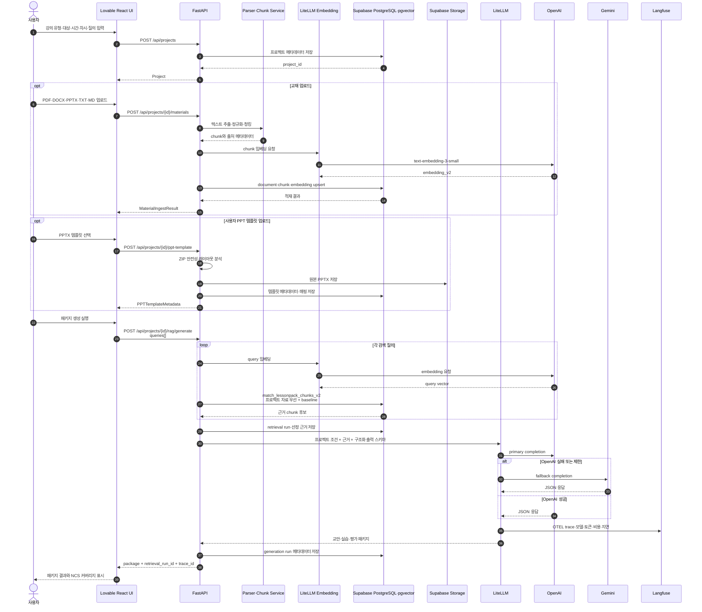
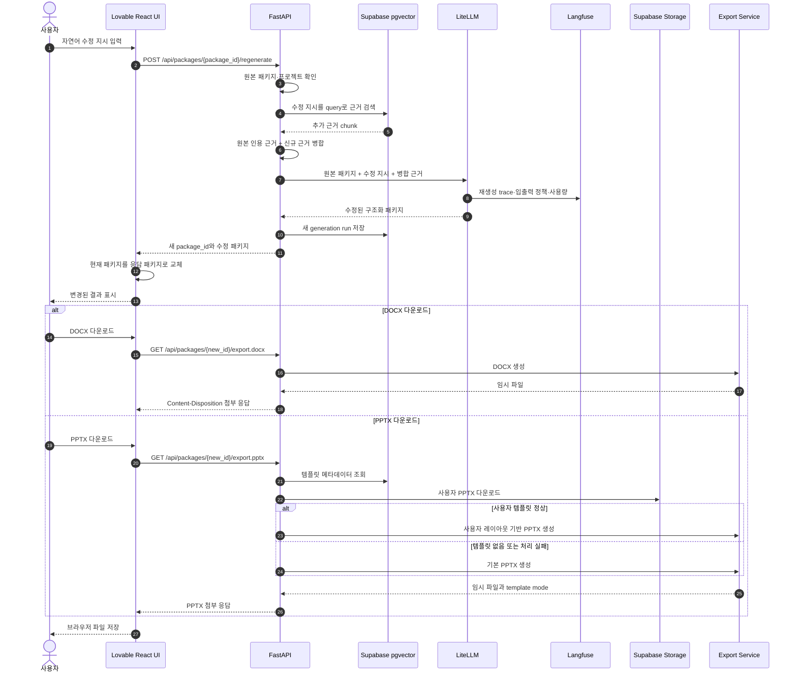
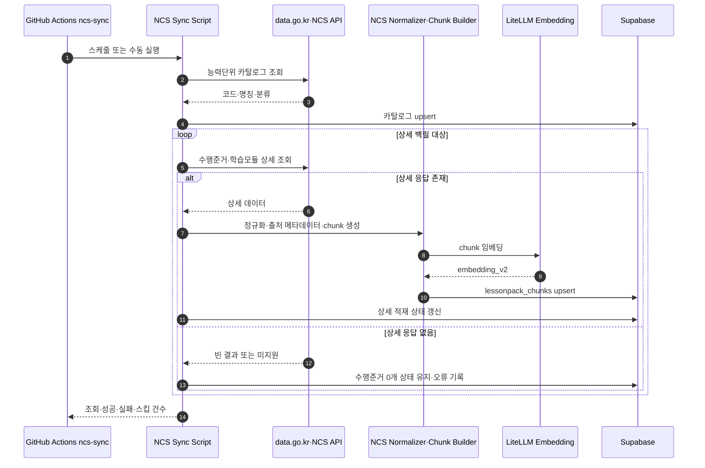

# LessonPack AI 시퀀스 다이어그램

## 1. 문서 목적

이 문서는 현재 프론트엔드와 FastAPI 백엔드가 프로젝트 생성, 자료 적재, RAG 패키지 생성, 자연어 재생성 및 다운로드를 처리하는 순서를 정의한다.

## 2. 프로젝트 생성·자료 적재·패키지 생성

## 3. 자연어 재생성과 다운로드

## 4. NCS 공식 API 동기화

## 5. 예외 계약

| 조건 | API 결과 | 사용자 동작 |
| --- | --- | --- |
| 검색 근거 없음 | `422` | 자료를 추가하거나 질의를 구체화 |
| LLM 생성 실패 | `502` | 잠시 후 재시도하며 Langfuse trace 확인 |
| Supabase 또는 저장소 장애 | `503` | health와 외부 서비스 상태 확인 |
| 프로젝트·패키지 없음 | `404` | 현재 프로젝트 또는 최신 package ID 재확인 |
| NCS 상세 근거 부족 | `422` 또는 수행준거 0개 표시 | 사용자 교재 업로드 또는 상세 동기화 수행 |
| 사용자 PPT 템플릿 처리 실패 | 기본 PPTX fallback | 응답 헤더의 template mode 확인 |

## 6. 현재 영속성 경계

- 프로젝트, 문서, chunk, retrieval run, generation run 메타데이터와 PPT 템플릿은 Supabase에 저장된다.
- 생성된 패키지 본문과 generation log 조회 객체는 현재 FastAPI 프로세스 메모리에 저장된다.
- DOCX/PPTX는 요청 시 임시 디렉터리에 생성된다.
- 따라서 컨테이너 재시작 이후 과거 package ID 재조회가 필요한 운영 요구는 별도 패키지 본문 영속화가 필요하다.
