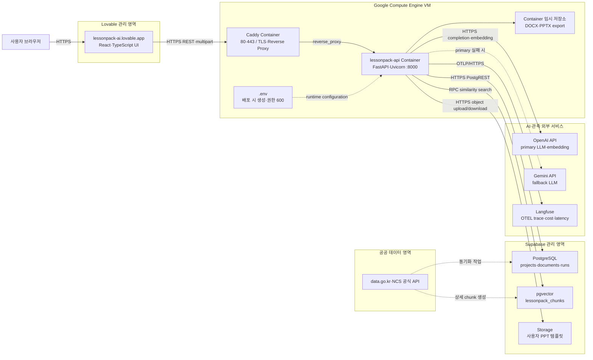
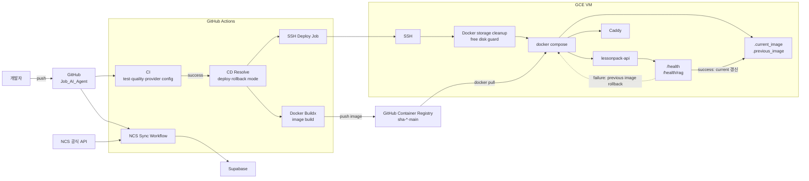

# LessonPack AI 배치 다이어그램

## 1. 문서 목적

이 문서는 LessonPack AI의 운영 배치(Deployment) 구조, 외부 연동, 네트워크 경계 및 CI/CD 경로를 나타낸다. 물리 서버 내부 구성과 관리형 외부 서비스는 서로 다른 신뢰 경계로 구분한다.

## 2. 운영 서비스 배치

## 3. CI/CD 배치

## 4. 노드별 책임

| 노드 | 책임 | 영속성 |
| --- | --- | --- |
| Lovable 프론트엔드 | 사용자 입력, 업로드, 결과 표시, 다운로드 요청 | 브라우저 상태 중심 |
| Caddy | TLS 인증서, HTTPS 종단, FastAPI reverse proxy | 인증서·Caddy volume |
| FastAPI 컨테이너 | 입력 검증, 파싱, RAG, 생성, 내보내기 | 패키지 본문은 현재 프로세스 메모리 |
| Supabase PostgreSQL | 프로젝트·문서·검색·생성 실행 메타데이터 | 영속 |
| Supabase pgvector | chunk와 외부 임베딩, 유사도 검색 | 영속 |
| Supabase Storage | 사용자 PPTX 템플릿 원본 | 영속 |
| OpenAI | 기본 구조화 생성과 embedding | 외부 관리 |
| Gemini | OpenAI 실패 시 생성 fallback | 외부 관리 |
| Langfuse | 생성 trace, 토큰, 비용, latency | 외부 관리 |
| GHCR | 배포 가능한 Docker image | tag·digest 단위 보관 |
| GitHub Actions | CI, 이미지 build, SSH 배포, NCS 동기화 | 실행 로그·artifact |

## 5. 네트워크·보안 경계

| 연결 | 프로토콜 | 통제 |
| --- | --- | --- |
| 브라우저 → Lovable | HTTPS | 호스팅 플랫폼 TLS |
| Lovable → Caddy | HTTPS | 허용 origin 기반 CORS |
| Caddy → FastAPI | Docker 내부 HTTP | 외부에는 8000 직접 노출을 최소화 |
| FastAPI → Supabase | HTTPS | service role key를 서버 환경변수로만 주입 |
| FastAPI → OpenAI·Gemini | HTTPS | API key를 GitHub Secrets와 GCE `.env`로 관리 |
| FastAPI → Langfuse | OTLP over HTTPS | public·secret key 및 capture 정책 적용 |
| GitHub Actions → GCE | SSH | 전용 SSH key와 `known_hosts` 검증 |
| NCS sync → 공식 API | HTTPS | `DATA_GO_KR_SERVICE_KEY`를 secret으로 관리 |

## 6. 가용성·복구 기준

1. 배포 전 Docker 미사용 이미지와 builder cache를 정리하고 최소 여유 디스크를 검사한다.
2. 새 image 실행 후 `/health`와 `/health/rag`가 모두 통과해야 배포를 성공으로 기록한다.
3. health 실패 시 `.previous_image`를 다시 실행하여 직전 버전으로 롤백한다.
4. Caddy는 API 컨테이너와 분리하여 TLS와 애플리케이션 장애 범위를 구분한다.
5. Supabase, LLM, Langfuse 장애는 같은 health 상태로 뭉개지 않고 연동별 readiness와 실행 로그로 구분한다.
6. 현재 패키지 본문은 컨테이너 재시작 시 소실될 수 있으므로, 장기 조회가 필요하면 Supabase 기반 package repository를 추가한다.

## 7. 관련 문서

- [WBS](01_WBS.md)
- [시퀀스 다이어그램](02_시퀀스_다이어그램.md)
- [GCE·Docker·CI/CD 배포 계획서](../02_implementation-readiness/05_GCE_Docker_CICD_배포_계획서.md)
- [NCS 공식 API RAG 동기화 계획서](../02_implementation-readiness/12_NCS_공식_API_RAG_자동_동기화_기획서.md)
